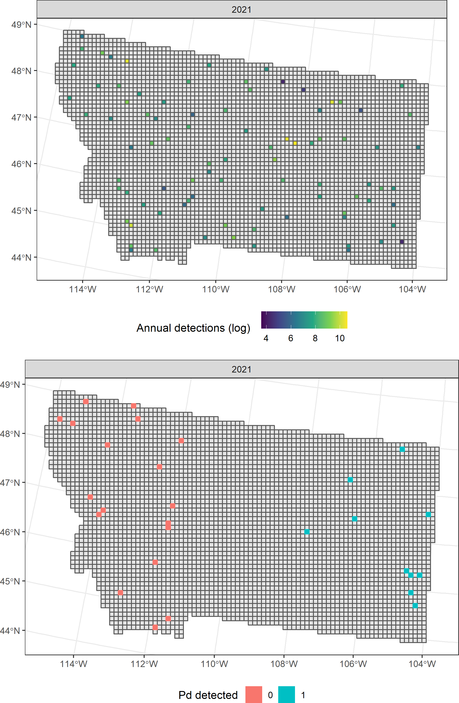

# Sampling model

## Spatial disease process

Let $\{y_1, \dots, y_n\}$ denote observed disease presence/absence at locations $\boldsymbol{s}$. Let $\boldsymbol{s^*}$ represent unobserved locations at which spatial predictions are desired. Then,
\[
\begin{split}
y_i &\sim \text{Bernoulli}(\pi_i) \\
\text{logit}(\pi_i) &= \alpha_0 + \eta_i \\
\begin{bmatrix}
\boldsymbol{\eta} \\ \boldsymbol{\eta^*}
\end{bmatrix} &\sim 
\mathcal{N}\left( 
\begin{bmatrix}
\boldsymbol{0} \\ \boldsymbol{0}
\end{bmatrix}, 
\begin{bmatrix}
\boldsymbol{\Sigma}_{11} &  \boldsymbol{\Sigma}_{12} \\
\boldsymbol{\Sigma}_{21} &  \boldsymbol{\Sigma}_{22}
\end{bmatrix}
\right)
\end{split}
\]
where
\[
\begin{split}
\Sigma_{11}^{(ij)} &= \sigma^2 K(\boldsymbol{s}_i, \boldsymbol{s}_j) = \sigma^2 \exp\left(-\frac{||\boldsymbol{s}_i - \boldsymbol{s}_j||^2}{2\phi^2}\right) \\
\Sigma_{22}^{(ij)} &= \sigma^2 K(\boldsymbol{s}^*_i, \boldsymbol{s}^*_j) = \sigma^2 \exp\left(-\frac{||\boldsymbol{s}^*_i - \boldsymbol{s}^*_j||^2}{2\phi^2}\right) \\
\Sigma_{12}^{(ij)} &= \sigma^2 K(\boldsymbol{s}_i, \boldsymbol{s}^*_j) = \sigma^2 \exp\left(-\frac{||\boldsymbol{s}_i - \boldsymbol{s}^*_j||^2}{2\phi^2}\right)
\end{split}
\]

## Observed activity data

Let $\{c_1, \dots, c_m\}$ denote observed activity at locations $\boldsymbol{s}^*$. Then,
\[
\begin{split}
c_i &\sim \text{NB}(\xi, p_i) \\
\text{logit}(p_i) &= \boldsymbol{x}_i^T\boldsymbol{\beta} + \alpha \eta_i^*
\end{split}
\]
Note that by properties of multivariate normal random variables,
\[
\boldsymbol{\eta}^* | \boldsymbol{\eta} \sim \mathcal{N}(\boldsymbol{\mu}_{2|1}, \boldsymbol{\Sigma}_{2|1})
\]
where
\[
\begin{split}
\boldsymbol{\Sigma}_{2|1} &= \boldsymbol{\Sigma}_{22} - \boldsymbol{\Sigma}_{21}\boldsymbol{\Sigma}^{-1}_{11}\boldsymbol{\Sigma}_{12} \\
\boldsymbol{\mu}_{2|1} &= \boldsymbol{\Sigma}_{21} \boldsymbol{\Sigma}^{-1}_{11}\boldsymbol{\eta}
\end{split}
\]

## Example data

# Derivations

Where possible, we exploit data augmentation strategies to afford Gibbs draws. Otherwise, we implement the NUTS algorithm [@hoffman2014] to take Hamiltonian Monte Carlo draws from posterior distributions.

## Polya-gamma data augmentation

For binomial and negative binomial sampling models, we implement the Polya-gamma data augmentation strategy of @polson2013. This strategy introduces auxiliary Polya-gamma distributed random variables to each likelihood to afford conditionally Gaussian posterior distributions, allowing for Gibbs draws of regression coefficients. This data augmentation is relevant for sampling $\alpha_0$, $\boldsymbol{\eta}$, and $\boldsymbol{\eta}^*$. 

## Sampling $\boldsymbol{\omega}^{(y)}$

Let $\omega^{(y)}_i \sim \text{PG}(1, 0)$. Then,
\[
z_i = \frac{1}{\omega_i}\left(y_i - \frac{1}{2}\right) \sim \mathcal{N}\left(\alpha_0 + \eta_i, \frac{1}{\omega_i} \right).
\]
See @polson2013 for more detail. Equivalently, let $\boldsymbol{\Omega}_{(y)} = \text{diag}(\omega_1, \dots, \omega_n)$. Then,
\[
\boldsymbol{z} \sim \mathcal{N}\left(\alpha_0 \boldsymbol{1} + \boldsymbol{\eta}, \boldsymbol{\Omega}_{(y)}^{-1}\right)
\]
From @polson2013, the full conditional distribution of $\omega_i$ is
\[
\begin{split}
\omega_i | \cdot \sim \text{PG}(1, \alpha_0 + \eta_i)
\end{split}
\]

## Sampling $\alpha_0$

Let $\alpha_0 \sim N(\mu_0, \sigma_0^2)$ and $\boldsymbol{z}^* = \boldsymbol{z} - \boldsymbol{\eta}$. Then,
\[
\begin{split}
\alpha_0 | \cdot &\sim \mathcal{N}(m, V) \\
V &= \left(tr(\boldsymbol{\Omega}_{(y)}) + \frac{1}{\sigma_0^2}\right)^{-1} \\
m &= V \left(\boldsymbol{\omega} \cdot \boldsymbol{z}^* + \frac{\mu_0}{\sigma_0^2} \right)
\end{split}
\]

Proof:

## Sampling $\boldsymbol{\eta}$

Let $\boldsymbol{z}^* = \boldsymbol{z} - \boldsymbol{\eta}$. Then,
\[
\begin{split}
\boldsymbol{\eta} | \cdot &\sim \mathcal{N}(\boldsymbol{m}, \boldsymbol{V}) \\
\boldsymbol{V} &= \left(\boldsymbol{\Omega}_{(y)} + \boldsymbol{\Sigma}^{-1}_{11}\right)^{-1} \\
\boldsymbol{m} &= \boldsymbol{V} \left(\boldsymbol{\Omega}_{(y)} \boldsymbol{z}^*\right)
\end{split}
\]

## Sampling $\sigma^2$

Let $\sigma^2 \sim \text{IG}(a_0, b_0)$. Then,
\[
\begin{split}
\sigma^2 | \cdot &\sim \text{IG}(a, b) \\
a &= a_0 + \frac{n}{2} \\
b &= b_0 + \frac{1}{2} \boldsymbol{\eta}^T K(\boldsymbol{s}, \boldsymbol{s}') \boldsymbol{\eta}
\end{split}
\]

## Sampling $\phi^2$

### HMC and Jacobian transformation

Since no conjugate distribution is known for $\phi^2$, we sample this parameter with HMC, which requires the log-posterior and gradient of the log-posterior up to proportionality. Additionally, HMC requires proposals across all real numbers [@thomas2021]. Let $\phi^2 \sim \text{IG}(c, d)$. Following @thomas2021, we apply a Jacobian transformation to find the distribution of $\gamma = g(\phi^2) =  \ln \phi^2$. 
\[
\begin{split}
p(\gamma | a, b) &= p_{\phi^2}(g^{-1}(\gamma)) \left|\frac{d \phi^2}{d \gamma} \right| \\
&= \frac{b^a}{\Gamma(a)} \left(e^\gamma\right)^{-a - 1} \exp\left( -\frac{b}{e^\gamma}\right) e^\gamma \\
&= \frac{b^a}{\Gamma(a)} e^{-a\gamma}\exp\left( -\frac{b}{e^\gamma}\right) \\
&\propto e^{-a \gamma} \exp\left( -\frac{b}{e^\gamma}\right)
\end{split}
\]
and $\ln p(\gamma | a, b) \propto -a\gamma - be^{-\gamma}$.

### Closed forms for sampling

The log-posterior and gradient of the log-posterior are given in terms of $\gamma$. First recall that 
\[
\Sigma_{11}^{(ij)} = \sigma^2 K(\boldsymbol{s}_i, \boldsymbol{s}_j) = \sigma^2 \exp\left(-\frac{||\boldsymbol{s}_i - \boldsymbol{s}_j||^2}{2\phi^2}\right) = \sigma^2 \exp\left(-\frac{||\boldsymbol{s}_i - \boldsymbol{s}_j||^2}{2e^\gamma}\right)
\]
Then,
\[
\begin{split}
\ln p(\gamma | \cdot) &\propto \ln p(\boldsymbol{\eta} | \cdot) + \ln p(\gamma) \\
&\propto -\frac{1}{2} \ln|\boldsymbol{\Sigma}_{11}| - \frac{1}{2} \boldsymbol{\eta}^T \boldsymbol{\Sigma}^{-1}_{11} \boldsymbol{\eta} -a\gamma - be^{-\gamma} \\
\nabla_\gamma  \ln p(\gamma | \cdot) &\propto \frac{1}{2}\text{tr}\left(\left[\boldsymbol{\Sigma}^{-1}_{11} \boldsymbol{\eta} \boldsymbol{\eta}^T \boldsymbol{\Sigma}^{-1}_{11} - \boldsymbol{\Sigma}^{-1}_{11}\right] \frac{\partial \boldsymbol{\Sigma}^{-1}_{11}}{\partial \gamma}\right) - a + b e^{-\gamma}
\end{split} 
\]
where the last line follows from page 114 of @rasmussen2006. 

## Sampling $\boldsymbol{\omega}^{(c)}$

We again leverage the Polya-gamma data augmetation strategy of @polson2013 for the negative binomial counts. See @pillow2012 for example.

Let $\omega^{(c)}_i \sim \text{PG}(1, 0)$. Then,
\[
z_i = \frac{1}{2\omega^{(c)}_i}\left(c_i - \xi\right) \sim \mathcal{N}\left(\boldsymbol{x}_i^T \boldsymbol{\beta} + \eta_i^*\alpha, \frac{1}{\omega_i} \right).
\]
Equivalently, let $\boldsymbol{\Omega}_{(c)} = \text{diag}(\omega^{(c)}_1, \dots, \omega^{(c)}_m)$. Then,
\[
\boldsymbol{z}_{(c)} \sim \mathcal{N}\left(\boldsymbol{X}\boldsymbol{\beta} + \boldsymbol{\eta}^* \alpha, \boldsymbol{\Omega}_{(c)}^{-1}\right)
\]
From @pillow2012, the full conditional distribution of $\omega^{(c)}_i$ is
\[
\begin{split}
\omega^{(c)}_i | \cdot \sim \text{PG}(c_i + \xi, \boldsymbol{x}_i^T \boldsymbol{\beta} + \eta_i^*\alpha)
\end{split}
\]

## Sampling $\boldsymbol{\eta}^*$

Recall that 
\[
\boldsymbol{\eta}^* | \boldsymbol{\eta} \sim \mathcal{N}(\boldsymbol{\mu}_{2|1}, \boldsymbol{\Sigma}_{2|1})
\]
where
\[
\begin{split}
\boldsymbol{\Sigma}_{2|1} &= \boldsymbol{\Sigma}_{22} - \boldsymbol{\Sigma}_{21}\boldsymbol{\Sigma}^{-1}_{11}\boldsymbol{\Sigma}_{12} \\
\boldsymbol{\mu}_{2|1} &= \boldsymbol{\Sigma}_{21} \boldsymbol{\Sigma}^{-1}_{11}\boldsymbol{\eta}
\end{split}
\]
Then,
\[
\begin{split}
\boldsymbol{\eta}^* | \cdot &\sim \mathcal{N}(\boldsymbol{m}, \boldsymbol{V}) \\
\boldsymbol{V} &= \left(\alpha^2 \boldsymbol{\Omega}_{(c)} + \boldsymbol{\Sigma}^{-1}_{2|1}\right)^{-1} \\
\boldsymbol{m} &= \boldsymbol{V}
\left(\alpha\boldsymbol{\Omega}_{(c)} (\boldsymbol{z}_{(c)} - \boldsymbol{X}\boldsymbol{\beta}) + \boldsymbol{\Sigma}_{2|1} \boldsymbol{\mu}_{2|1} \right)
\end{split}
\]

## Sampling $\alpha$

Let $\alpha \sim N(\mu_{0, \alpha}, \sigma_{0, \alpha}^2)$. Then,
\[
\begin{split}
\alpha | \cdot &\sim N(m, V) \\
V &= \left(\boldsymbol{\eta}^* \boldsymbol{\Omega}_{(c)} \boldsymbol{\eta}^* + \frac{1}{\sigma_{0, \alpha}^2}\right) \\
m &= V \left(\boldsymbol{\eta}^* \boldsymbol{\Omega}_{(c)} (\boldsymbol{z}_{(c)} - \boldsymbol{X}\boldsymbol{\beta}) + \frac{\mu_{0, \alpha}}{\sigma_{0, \alpha}^2}\right)
\end{split}
\]

## Sampling $\boldsymbol{\beta}$

Let $\boldsymbol{\beta} \sim \mathcal{N}(\boldsymbol{\mu}_{0, \beta}, \boldsymbol{\Sigma}_{0, \beta})$. Then,
\[
\begin{split}
\boldsymbol{\beta} | \cdot &\sim \mathcal{N}(\boldsymbol{m}, \boldsymbol{V}) \\
\boldsymbol{V} &= \left(\boldsymbol{X}^T \boldsymbol{\Omega}_{(c)} \boldsymbol{X} +  \boldsymbol{\Sigma}^{-1}_{0, \beta}\right)^{-1} \\
\boldsymbol{m} &= \boldsymbol{V} \left(\boldsymbol{X}^T \boldsymbol{\Omega}_{(c)} (\boldsymbol{z}_{(c)} - \alpha \boldsymbol{\eta}^*) + \boldsymbol{\Sigma}^{-1}_{0, \beta}\boldsymbol{\mu}_{0, \beta} \right)
\end{split}
\]

## Sampling $\xi$

### HMC and Jacobian transformation

One option for sampling from $p(\xi | \cdot)$ is to again use HMC. Following the same argument as above, we let $\xi \sim \text{IG}(a, b)$ and $\zeta = \ln \xi$. Then,
\[
p(\zeta | a, b) = e^{-a\zeta}\exp \left(-\frac{b}{e^{\zeta}}\right)
\]
and $\ln p(\zeta | a, b) = -a\zeta - b e^{-\zeta}$.

### Closed forms for sampling

The log-posterior and gradient of the log-posterior are given in terms of $\zeta$. Let $\text{logit}(p_i) = \boldsymbol{x}_i^T \boldsymbol{\beta} + \alpha \eta_i^*$ First, consider the contribution of observation $i$ to the log posterior:
\[
\begin{split}
\mathcal{L}_i (c_i | \cdot) &= \ln\left( \frac{\Gamma(c_i + \exp(\zeta))}{\Gamma(c_i + 1)\Gamma(\exp(\zeta))} \right) + \exp(\zeta) \ln(1 - p_i) + c_i \ln(p_i) \\
&\propto \ln \Gamma(c_i + \exp(\zeta)) - \ln\Gamma(\exp(\zeta)) + \exp(\zeta) \ln(1 - p_i) + c_i \ln(p_i)
\end{split}
\]
Therefore, 
\[
\begin{split}
\ln p(\zeta | \cdot) &\propto \ln p(\boldsymbol{c} | \cdot) + \ln p(\zeta) \\
&\propto  -a\zeta - b e^{-\zeta} + \sum_{i=1}^m \mathcal{L}_i (c_i | \cdot) 
\end{split}
\]
To calculate the gradient, consider the gradient of the contribution of observation $i$ to the log posterior:
\[
\begin{split}
\nabla_\zeta \mathcal{L}_i (c_i | \cdot) &=  \psi(c_i + \exp(\zeta)) - \psi(\exp(\zeta)) + \exp(\zeta) \ln(1 - p_i) 
\end{split}
\]
where $\psi(x)$ is the digamma function. Therefore,
\[
\begin{split}
\nabla_\zeta \ln p(\zeta | \cdot) &\propto \nabla_\zeta\ln p(\boldsymbol{c} | \cdot) + \nabla_\zeta\ln p(\zeta) \\
&\propto  -a\zeta - b e^{-\zeta} + \sum_{i=1}^m \nabla_\zeta \mathcal{L}_i (c_i | \cdot) 
\end{split}
\]

### Gibbs sampling via data augmentation

Alternatively, samples from $p(\xi | \cdot)$ may be drawn via the data augmentation strategy described by @zhou2012.

